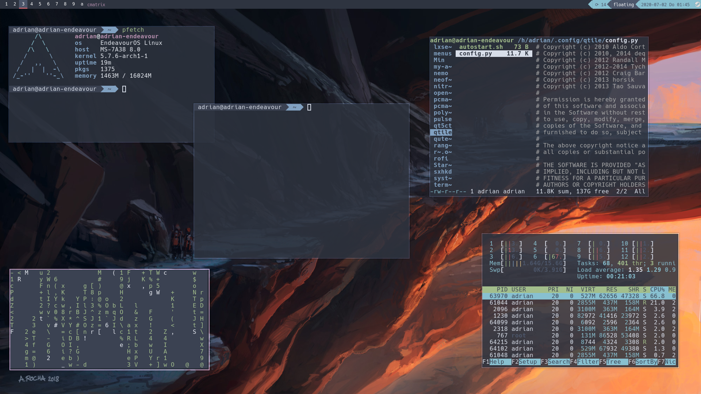

# dotfiles

# Screenshot



Commands to Install my dotfiles:
```
wget https://raw.githubusercontent.com/rndm-adrian/dotfiles/master/setup.md -O ~/dotfile-setup.sh
chmod 775 ~/dotfile-setup.sh
~/dotfile-setup.sh
```
Your old dotfiles are moved in a directory called 
`
~/conf_backup
`


## WARNING
CLONE THE REPO INTO THE HOME DIRECTORY

The script wont work if you clone it anywhere else

DONT DELETE THE ~/dotfiles DIRECTORY

If you do it anyway the dotfiles will be discarded

## Credits
[andreasrocha](https://www.deviantart.com/andreasrocha) for the AWESOME [wallpaper](https://www.deviantart.com/andreasrocha/art/Mountain-Pass-746561460)

[zsh-users](https://github.com/zsh-users/) for [antigen for zsh](https://github.com/zsh-users/antigen)

[Nord](nordtheme.com) for the AWESOME [colorschemes](git.io/nord)

[DistroTube](youtube.com/distrotube) for the [colorscripts](https://gitlab.com/dwt1/shell-color-scripts) and his [Config](https:https://gitlab.com/dwt1/dotfiles)
